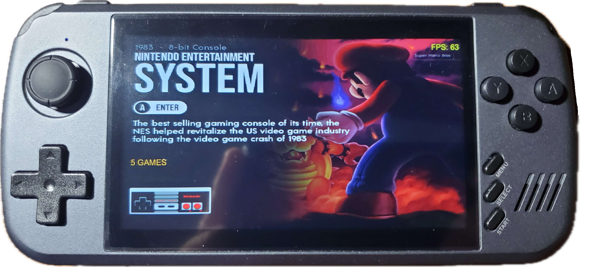

# SuperX CFW for Powkiddy X39 / X39 Pro / X45 / X51 / X70 #



**SuperX CFW**
Unlock full capability of your Powkiddy X series !

This CFW is basically a collection of softwares and emulators to replace the stock frontend !

Join on Discord: https://discord.gg/t48fC9ESnJ

# Disclaimer:
This custom firmware is provided "as is" without any warranties, express or implied.

I shall not be held responsible for any damage, loss of data, malfunction, bricking of the device, voided warranty, or any other issues resulting from the installation or use of this firmware.

By installing this firmware, you agree that you do so entirely at your own risk and assume full responsibility for any consequences.

# Supported devices:
- Powkiddy X39
- Powkiddy X39 Pro
- Powkiddy X45
- Powkiddy X51
- Powkiddy X70

# Launcher: Simplermenu_plus (SMP)
Button mapping:
- A : enter or launch a rom
- B : return / go back
- Y : Add/remove ROM from Favorite list
- L1/R1 : previous/next page in Rom List
- Select : Can override the default core for a system OR for a specific ROM (change selection with LEFT/RIGHT)
- Start : SMP options

In case of adding roms in the folders, you have to Update Caches from SMP Options.

Backlight is switched off after 1 minute of inactivity.

# Retroarch
Use:
- **SDL_POWKIDDY** for video
    - 4 Scaling mode:
      - integer_scaling && !keep_aspect : fill full physical height
      - !integer_scaling && keep_aspect: core output resolution
      - integer_scaling && keep_aspect: max scaling rounded to integer (x2,x3,x4)
      - !integer_scaling && !keep_aspect: full screen stretch
    - Threaded Video: Enabled (provide more performance, can be disabled in case of issue)
    - Image Interpolation:
      - Bicubic, Bilinear, Nearest neighbor, Catmull-Rom, Sharp Bilinear and Lanczos : All are using Hardware upscaler and apply video filtering without performance costs.
      - Software Nearest : Perform upscaling in software, can affect performances.
    - Video Filters:
      - You can apply video filters from RetroArch. This can affect performances.
- **ALSA (prefered)** or **SDL** for audio
    - Use resampler CC or nearest to 48000
    - Delay to 160ms
- **LINUXRAW** for input
- **SDL** for Gamepad

**L1 + R1** or **MENU** button to get menu in game
**L2 + R2** to exit RetroArch

**You can copy your bios in cfw/retroarch/system, stock SD card contains some bios in game/.bios folder**

# Retroarch cores included

Some cores requires BIOS to be copied in **cfw/retroarch/system** you can find related BIOS requirements in the dedicated link of each cores

You can see retroarch logs by using DinguxCommander and going to /tmp folder.

**Retroarch logs are not persistant across console restart**

| System | Folder(s) | Core(s) |
|----------|----------|----------|
| Amiga | amiga | puae, puae2021, uae4arm |
| Amiga CD | amigacd | puae, puae2021, uae4arm |
| Amstrad CPC | cpc | cap32 |
| Arcade | arcade | mame2000, mame2003, mame2003_plus, fbalpha2012, fbneo, fbneo_new |
| Atari 2600 | atari | stella2014 |
| Atari 5200 | fiftytwohundred | atari800 |
| Atari 7800 | seventytwohundred | prosystem |
| Atari Lynx | lynx | handy, mednafen_lynx |
| BennuGD | bennugd | bennugd |
| Cave | cave | mame2000, mame2003, mame2003_plus, fbalpha2012, fbneo, fbneo_new |
| CPS | cps | mame2000, mame2003, mame2003_plus, fbalpha2012, fbneo, fbneo_new |
| CPS1 | cps1 | mame2000, mame2003, mame2003_plus, fbalpha2012, fbneo, fbneo_new |
| CPS2 | cps2 | mame2000, mame2003, mame2003_plus, fbalpha2012, fbneo, fbneo_new |
| CPS3 | cps3 | mame2000, mame2003, mame2003_plus, fbalpha2012, fbneo, fbneo_new |
| Commodore 64 | commodore | vice_x64, vice_xvic |
| DOS | dos | dosbox_pure |
| Doom | doom | prboom |
| Fairchild Channel F | fairchild | freechaf |
| Famicom Disk System | fds | fceumm, nestopia, quicknes |
| Final Burn Alpha | fba | mame2000, mame2003, mame2003_plus, fbalpha2012, fbneo, fbneo_new |
| Game & Watch | gw | gw |
| Game Boy | gb | gambatte, gearboy, tgbdual |
| Game Boy Advance | gba | gpsp, mgba, vbam |
| Game Boy Color | gbc | gambatte, gearboy, tgbdual |
| Intellivision | intellivision | freeintv |
| J2ME | j2me | freej2me, freej2me-plus |
| Master System | ms | genesis_plus_gx, picodrive |
| Mega Drive / Genesis | md | genesis_plus_gx, picodrive |
| Mega Duck | megaduck | gambatte, gearboy, tgbdual |
| MSX | msx | bluemsx |
| Neo Geo | neogeo | fbalpha2012, fbneo, fbneo_new |
| Neo Geo CD | neocd | fbalpha2012, fbneo, fbneo_new |
| Neo Geo Pocket | ngp | mednafen_ngp |
| Neo Geo Pocket Color | ngpc | mednafen_ngp |
| NES / Famicom | fc, nes | fceumm, nestopia, quicknes |
| Odyssey² / Videopac | odyssey, videopac | o2em |
| PC Engine | pce | mednafen_pce, mednafen_pce_fast, mednafen_supergrafx |
| PC Engine CD | pcecd | mednafen_pce, mednafen_pce_fast, mednafen_supergrafx |
| Pico-8 | pico | fake08 |
| PlayStation | ps | pcsx_rearmed |
| Pokémon Mini | poke | pokemini |
| ScummVM | scummvm | scummvm |
| Sega Game Gear | gg | genesis_plus_gx, picodrive |
| Sega Master System | ms | genesis_plus_gx, picodrive |
| Sega 32X | thirtytwox | genesis_plus_gx, picodrive |
| Sega SG-1000 | segasgone | genesis_plus_gx, picodrive |
| Sega CD / Mega-CD | segacd | genesis_plus_gx, picodrive |
| Satellaview | satellaview | snes9x, snes9x2002, snes9x2005, snes9x2010 |
| SNES | sfc | snes9x, snes9x2002, snes9x2005, snes9x2010 |
| Sufami Turbo | sufami | snes9x, snes9x2002, snes9x2005, snes9x2010 |
| Super Game Boy | sgb | gambatte, gearboy, tgbdual |
| SuperGrafx | sgfx | mednafen_pce, mednafen_pce_fast, mednafen_supergrafx |
| TIC-80 | tic | tic80 |
| Vectrex | vectrex | vecx |
| VIC-20 | vic20 | vice_x64, vice_xvic |
| Virtual Boy | vb | mednafen_vb |
| WonderSwan | ws | mednafen_wswan |
| WonderSwan Color | wsc | mednafen_wswan |
| ZX Spectrum | zxs | fuse |

| Core | Link |
|------|------|
| 2048 | https://docs.libretro.com/library/2048/ |
| atari800 | https://docs.libretro.com/library/atari800/ |
| bennugd | https://github.com/diekleinekuh/BennuGD_libretro |
| bluemsx | https://docs.libretro.com/library/bluemsx/ |
| cap32 | https://docs.libretro.com/library/cap32/ |
| dosbox_pure | https://docs.libretro.com/library/dosbox_pure/ |
| fake08 | https://github.com/jtothebell/fake-08 |
| fbalpha2012 | https://docs.libretro.com/library/fbalpha2012/ |
| fbneo (from 2021 available on buildbot-libretro) | https://docs.libretro.com/library/fbneo/ |
| fbneo_new (most up-to-date, slower) | https://docs.libretro.com/library/fbneo/ |
| fceumm | https://docs.libretro.com/library/fceumm/ |
| freechaf | https://docs.libretro.com/library/freechaf/ |
| freeintv | https://docs.libretro.com/library/freeintv/ |
| freej2me | https://github.com/hex007/freej2me |
| freej2me-plus | https://github.com/TASEmulators/freej2me-plus |
| fuse | https://docs.libretro.com/library/fuse/ |
| gambatte | https://docs.libretro.com/library/gambatte/ |
| gearboy | https://docs.libretro.com/library/gearboy/ |
| genesis_plus_gx | https://docs.libretro.com/library/genesis_plus_gx/ |
| gpsp | https://docs.libretro.com/library/gpsp/ |
| gw | https://docs.libretro.com/library/gw/ |
| handy | https://docs.libretro.com/library/handy/ |
| mame2000 | https://docs.libretro.com/library/mame2000/ |
| mame2003 | https://docs.libretro.com/library/mame2003/ |
| mame2003_plus | https://docs.libretro.com/library/mame2003_plus/ |
| mednafen_lynx | https://docs.libretro.com/library/beetle_lynx/ |
| mednafen_ngp | https://docs.libretro.com/library/mednafen_ngp/ |
| mednafen_pce | https://docs.libretro.com/library/beetle_pce_fast/ |
| mednafen_pce_fast | https://docs.libretro.com/library/mednafen_pce_fast/ |
| mednafen_supergrafx | https://docs.libretro.com/library/mednafen_supergrafx/ |
| mednafen_vb | https://docs.libretro.com/library/mednafen_vb/ |
| mednafen_wswan | https://docs.libretro.com/library/mednafen_wswan/ |
| mgba | https://docs.libretro.com/library/mgba/ |
| mrboom | https://docs.libretro.com/library/mrboom/ |
| nestopia | https://docs.libretro.com/library/nestopia/ |
| o2em | https://docs.libretro.com/library/o2em/ |
| pcsx_rearmed | https://docs.libretro.com/library/pcsx_rearmed/ |
| picodrive | https://docs.libretro.com/library/picodrive/ |
| pokemini | https://docs.libretro.com/library/pokemini/ |
| prboom | https://docs.libretro.com/library/prboom/ |
| prosystem | https://docs.libretro.com/library/prosystem/ |
| puae (from 2021 available on buildbot-libretro) | https://docs.libretro.com/library/puae/ |
| puae2021 (most up-to-date, slower) | https://docs.libretro.com/library/puae/ |
| quicknes | https://docs.libretro.com/library/quicknes/ |
| scummvm | https://docs.libretro.com/library/scummvm/ |
| snes9x | https://docs.libretro.com/library/snes9x/ |
| snes9x2002 | https://docs.libretro.com/library/snes9x_2002/ |
| snes9x2005 | https://docs.libretro.com/library/snes9x_2005/ |
| snes9x2010 | https://docs.libretro.com/library/snes9x_2010/ |
| stella2014 | https://docs.libretro.com/library/stella2014/ |
| tgbdual | https://docs.libretro.com/library/tgbdual/ |
| tic80 (from 2021 available on buildbot-libretro) | https://docs.libretro.com/library/tic80/ |
| uae4arm | https://github.com/libretro/uae4arm-libretro |
| vbam | https://docs.libretro.com/library/vbam/ |
| vecx | https://docs.libretro.com/library/vecx/ |
| vice_x64 | https://docs.libretro.com/library/vice/ |
| vice_xvic | https://docs.libretro.com/library/vice/ |

# Known issues:
 - Using 2x Video filter with PCSX-Rearmed core is creating graphical glitches
 - FPS overlay is upscaled with the core output when using Hardware upscaler.
   - You can disable the overlay in RetroArch Settings->On-Screen Display->On-Screen Notifications->Notification Visibility-> Enable Menu-only notifications
 - No sounds for J2ME core

# Installation:
 - Copy zip content on SD-card. run.sh must be at the root of the sdcard
 - You can copy your bios in CFW/retroarch/system, stock SD card contains some bios in game/.bios folder
 - 
 **Only in case of first installation:**
 - Reboot the console and perform the update when asked by the console. If the update is not detected, remove and insert the SD card when builtin frontend is started.
 
# Uninstall:
 - Remove run.sh

# Changelog
## V1.1:
General:
- Support of all Powkiddy ATM7051: x39, x39pro, x45, x51 and x70
- Disable/enable loudpspeaker depending on which app is started
- Create welcome and poweroff screen image. In APPS you can find Activate_bootlogo and Restore_bootlogo
- Play a welcome and poweroff sound
- Enhancement of the building process and flag optimization (increased performance)

Retroarch:
- Add uae4arm, bennugd, fake08, freej2me and freej2me-plus cores
- Puae2021 and fbneo-new are most up-to-date but seems to be slower, use puae and fbneo (version from libretro buildbot 2021)
- Bump all cores to last recent version
- X51 variant : Rotate 90° screen in SMP and Retroarch
- Fix FPS counter display
- Fix Integer Scale only scaling when no rotation is applied (fill screen height)
- Fix Software nearest invalid rotation when core output in 32bpp

SMP Launcher:
- Unifying of all resolutions in one single theme.ini and adapt all resolutions placements (854x480,816x480,800x480,1024x600,480x272)
- Refactoring of systems.json
- Add CAVE, Bennugd, j2me and Pico8 systems
- Add multiple translation language
- Add progress during rom list generation
- Fix issue when adding first favorite
- Fix issue with non-ascii characters

## V1:
- Major update with launcher Simplermenu_Plus integration and faster starting
- New system folder structures and lot of cores added
- Some apps included (DinguxCommander and Terminal)
- ADB shell startup at beginning
  
## V0.3:
**Many thanks to @dmolina007 [https://github.com/dmolina007] for the tests and suggestions !**

- Audio delay set to 160 
- 4 Scaling mode:
  - integer_scaling && !keep_aspect : fill full physical height
  - !integer_scaling && keep_aspect: core output resolution
  - integer_scaling && keep_aspect: max scaling rounded to integer (x2,x3,x4)
  - !integer_scaling && !keep_aspect: full screen stretch
- Charging mode do not start Retroarch
- 3 new cores (mednafen_ngp, mednafen_vb, ffmpeg [degraded performances and crash])
- Correct gamepad button assignement
- Earphone detection
- ADB shell and file transfer activation on USB detection
- Restart Retroarch and Bilinear filtering options removed
- Screen rotation in RetroArch's settings
- Cleanup source code

## V0.2
- Scaling and rotation of the screen in retroarch to avoid SDL Shadowbuf, FPS > 150 in menu
- Upscaling nearest (fast) and bilinear (slow unless we use HW scaler)
- Better sound parameters and usage of ATC2603 registers

# Build from source:
 - Install Ubuntu or WSL2
 - Get this repository (git clone ...)
 - cd powkiddy....
 - ./build-all.sh

# Credits:
- @dmolina007 [https://github.com/dmolina007] for theme developments, ideas, support, testing and discord maintenance
- @dajoho [https://github.com/dajoho] for the help in adjusting building process and the custom and generic update.zip working on all consoles models.
- @acmeplus [https://github.com/acmeplus] for his help and simplermenu_plus launcher ([https://github.com/rg35xx-cfw/simplermenu_plus](https://github.com/rg35xx-cfw/simplermenu_plus))
- @FoxExe [https://github.com/FoxExe] for the firmware extractor/generator to update stock firmware ([https://github.com/FoxExe/PowKiddy_fw](https://github.com/FoxExe/PowKiddy_fw))
- Retroarch/Libretro teams and all cores creators 
- DinguxCommander creator (https://tardigrade-nx.github.io/2011/dinguxcommander/)
- st-sdl creator (https://github.com/benob/rs97_st-sdl)
  
# Notes:

## ADB
ADB is running on native FS, this CFW is mounting a new FS and chroot to it.

Once in adb shell, you can check content of run.sh to mount the newfs and chroot to it

## ALSA SOUND
Driver source: https://github.com/LeMaker/linux-actions/tree/linux-3.10.y/sound/soc/atc260x

32 bits / rate 8000-192000 / stereo

Avoid MMAP ! sound is really dirty !

Buffer size 768

Period size 7680

use plug !

cat /proc/asound/card0/pcm0p/sub0/hw_params

content of /mnt/card/cfw/alsa.conf :
```
pcm.hw0 {
    type hw
    card 0
    device 0
}
pcm.!default {
    type plug
    slave.pcm "hw0"
    slave.format S32_LE
    slave.channels 2
}

ctl.!default {
    type hw
    card 0
}

```

## Keybinding
```
/* Powkiddy X39 Pro button mapping - customize based on your evtest results */
#define EVDEV_BTN_A      158  
#define EVDEV_BTN_B      139  
#define EVDEV_BTN_X      308  
#define EVDEV_BTN_Y      352  
#define EVDEV_BTN_L1     407  
#define EVDEV_BTN_R1     412  
#define EVDEV_BTN_L2     313  
#define EVDEV_BTN_R2     312  
#define EVDEV_BTN_SELECT 314  
#define EVDEV_BTN_START  315  
#define EVDEV_BTN_MENU   174  
#define EVDEV_BTN_VOLUP  115  
#define EVDEV_BTN_VOLDOWN 114  
#define EVDEV_BTN_ON 116  
```
## Watchdog

link to driver: https://github.com/LeMaker/linux-actions/blob/linux-3.10.y/drivers/watchdog/owl_wdt.c
