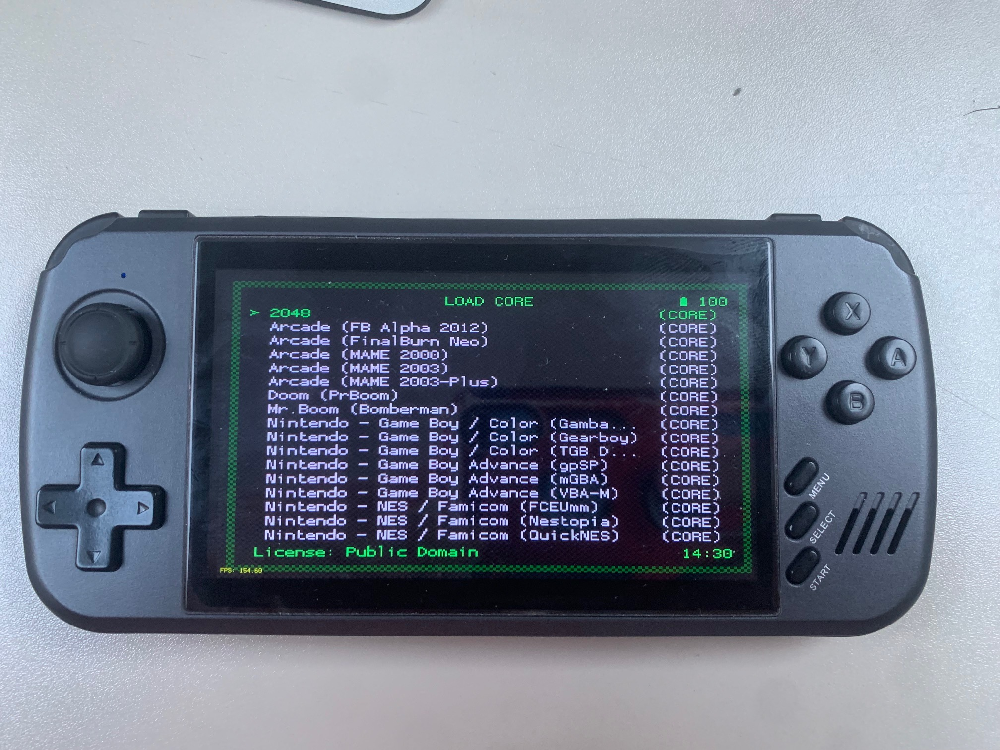

# SuperX CFW for Powkiddy X39 Pro / X45 / X51 / X70 #



Enjoy real memory card for multicd PSX games and ability to change the screen-scaling !

This CFW is basically a collection of softwares and emulators to replace the stock frontend !

Discord: https://discord.gg/ygsaNNsG

# Disclaimer:
This custom firmware is provided "as is" without any warranties, express or implied.

I shall not be held responsible for any damage, loss of data, malfunction, bricking of the device, voided warranty, or any other issues resulting from the installation or use of this firmware.

By installing this firmware, you agree that you do so entirely at your own risk and assume full responsibility for any consequences.

# Supported devices:
- Powkiddy X39 Pro

# Unsupported:
We need testers to support:
- X45
- X51
- X70 

# Retroarch
Use:
- **SDL_POWKIDDY** for video
    - You can upscale with Keep aspect ratio and Integer scaling options (Settings -> Video -> Scaling)
    - You can change screen orientation (Settings -> Video -> Output)
- **ALSA (prefered)** or **SDL** for audio
    - Use resampler CC or nearest to 48000
    - Delay to 160ms
- **LINUXRAW** for input
- **LINUXRAW (prefered)** or **SDL** for Gamepad

**L1 + R1** or **MENU** button to get menu in game

**You can copy your bios in cfw/retroarch/system, stock SD card contains some bios in game/.bios folder**

# Retroarch cores included
- Standalone:
  - 2048
  - mrboom
  - prboom
- GB/GBC/GBA:
  - gambatte
  - gearboy
  - gpsp
  - mgba
  - tgbdual
  - vbam
- NES:
  - fceumm
  - nestopia
  - quicknes
- SNES:
  - snes9x2002
  - snes9x2005
  - snes9x2010
  - snes9x
- Megadrive:
  - genesis_plus_gx
  - picodrive
- PSX:
  - pcsx_rearmed
- Neogeo/CPS/Arcade
  - fbalpha2012
  - fbneo
  - mame2000
  - mame2003
  - mame2003_plus
- Others:
  - mednafen_ngp
  - mednafen_vb

# Installation:
 - Copy zip content on SD-card. run.sh must be at the root of the sdcard
 - You can copy your bios in CFW/retroarch/system, stock SD card contains some bios in game/.bios folder

 **Only in case of first installation:**
 
 - Put update.zip on SD Card 
      -  update.zip contains original Powkiddy firmware with startup script updated
      -  **Verify the update.zip CRC once copied on SD is correct !**  
 - Reboot the console and perform the update when asked by the console. If the update is not detected, remove and insert the SD card when builtin frontend is started.

## In case of CFW update and unless specified, the update.zip process is not required, only extract the cfw to the SD.
 
# Uninstall:
 - Remove run.sh

# Changelog
## V0.5:
- Major update with launcher Simplermenu_Plus integration and faster starting
- Some apps included (DinguxCommander and Terminal)
- ADB shell startup at beginning
  
## V0.3:
**Many thanks to @dmolina007 [https://github.com/dmolina007] for the tests and suggestions !**

- Audio delay set to 160 
- 4 Scaling mode:
  - integer_scaling && !keep_aspect : fill full physical height
  - !integer_scaling && keep_aspect: core output resolution
  - integer_scaling && keep_aspect: max scaling rounded to integer (x2,x3,x4)
  - !integer_scaling && !keep_aspect: full screen stretch
- Charging mode do not start Retroarch
- 3 new cores (mednafen_ngp, mednafen_vb, ffmpeg [degraded performances and crash])
- Correct gamepad button assignement
- Earphone detection
- ADB shell and file transfer activation on USB detection
- Restart Retroarch and Bilinear filtering options removed
- Screen rotation in RetroArch's settings
- Cleanup source code

## V0.2
- Scaling and rotation of the screen in retroarch to avoid SDL Shadowbuf, FPS > 150 in menu
- Upscaling nearest (fast) and bilinear (slow unless we use HW scaler)
- Better sound parameters and usage of ATC2603 registers

# Build from source:
 - Install Ubuntu or WSL2
 - Get this repository
 - git submodule init
 - git submodule update
 - run the scripts 0.prepare.sh, 1.make-libs.sh, etc....

# Credits:
- @dmolina007 [https://github.com/dmolina007] for theme developments, ideas, support and testing
- @acmeplus [https://github.com/acmeplus] for his help and simplermenu_plus launcher ([https://github.com/rg35xx-cfw/simplermenu_plus](https://github.com/rg35xx-cfw/simplermenu_plus))
- @FoxExe [https://github.com/FoxExe] for the firmware extractor/generator to update stock firmware ([https://github.com/FoxExe/PowKiddy_fw](https://github.com/FoxExe/PowKiddy_fw))
- Retroarch/Libretro teams and all cores creators 
- DinguxCommander creator (https://tardigrade-nx.github.io/2011/dinguxcommander/)
- st-sdl creator (https://github.com/benob/rs97_st-sdl)
  
# Notes:

## Updated /etc/init.d/rcS script to start retroarch on boot:

This is running run.sh script on the SD Card
```
                        echo "run nomal mode"
                        mount /dev/mmcblk0p1 /mnt/card/
                        sleep 5
                        /mnt/card/run.sh &
                        sleep 5
                        manager &
```

## ADB
ADB is running on native FS, this CFW is mounting a new FS and chroot to it.

Once in adb shell, you can check content of run.sh to mount the newfs and chroot to it

## ALSA SOUND
Driver source: https://github.com/LeMaker/linux-actions/tree/linux-3.10.y/sound/soc/atc260x

32 bits / rate 8000-192000 / stereo

Avoid MMAP ! sound is really dirty !

Buffer size 768

Period size 7680

use plug !

cat /proc/asound/card0/pcm0p/sub0/hw_params

content of /mnt/card/cfw/alsa.conf :
```
pcm.hw0 {
    type hw
    card 0
    device 0
}
pcm.!default {
    type plug
    slave.pcm "hw0"
    slave.format S32_LE
    slave.channels 2
}

ctl.!default {
    type hw
    card 0
}

```

## Keybinding
```
/* Powkiddy X39 Pro button mapping - customize based on your evtest results */
#define EVDEV_BTN_A      158  
#define EVDEV_BTN_B      139  
#define EVDEV_BTN_X      308  
#define EVDEV_BTN_Y      352  
#define EVDEV_BTN_L1     407  
#define EVDEV_BTN_R1     412  
#define EVDEV_BTN_L2     313  
#define EVDEV_BTN_R2     312  
#define EVDEV_BTN_SELECT 314  
#define EVDEV_BTN_START  315  
#define EVDEV_BTN_MENU   174  
#define EVDEV_BTN_VOLUP  115  
#define EVDEV_BTN_VOLDOWN 114  
#define EVDEV_BTN_ON 116  
```
## Watchdog

link to driver: https://github.com/LeMaker/linux-actions/blob/linux-3.10.y/drivers/watchdog/owl_wdt.c
